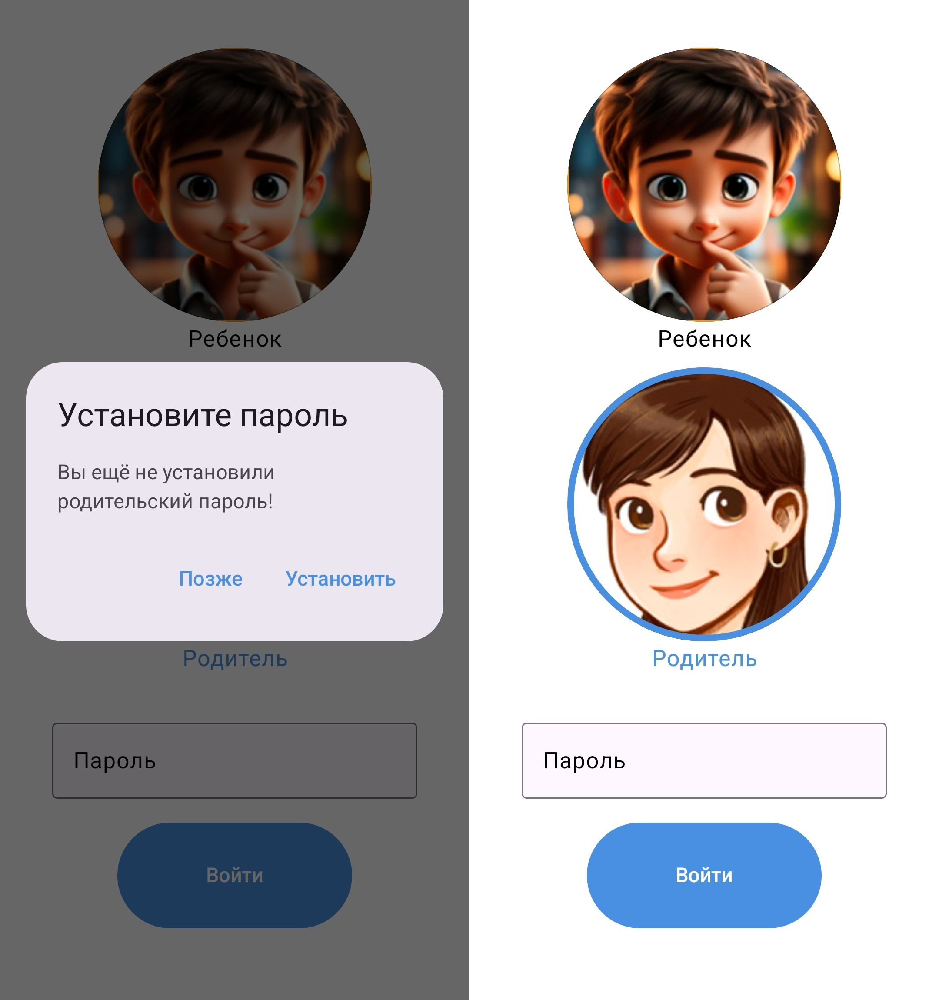
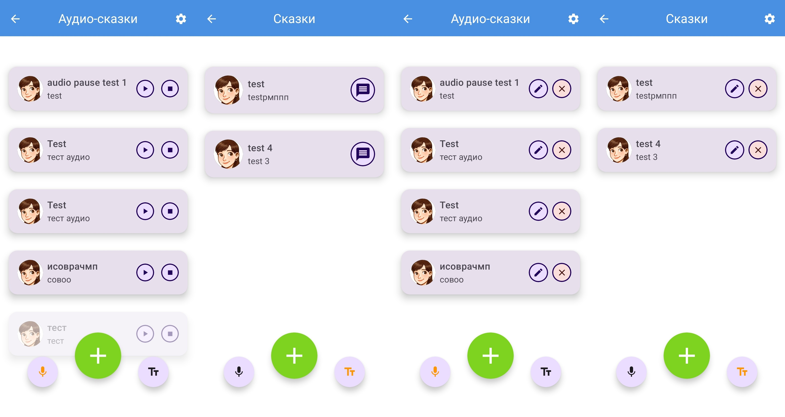
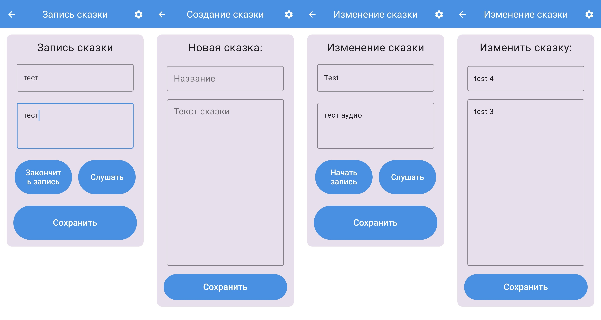
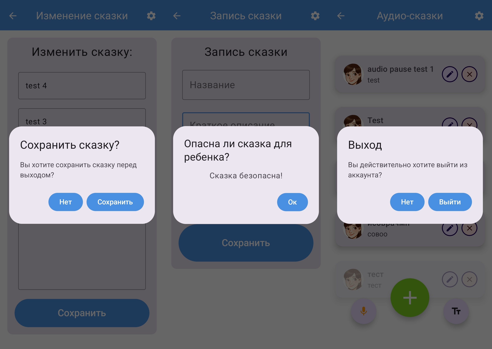

# 📱 "Моя сказка" — Мобильное приложение для родителей, позволяющее записывать сказки

Добро пожаловать! Это мой **pet-проект** - Android-приложение для родителей и детей, позволяющее **записывать и прослушивать сказки - аудио и текстовые**, при этом встроенный **ИИ анализирует содержание и определяет его безопасность для детей**.
Изначально идея проекта была частью моей диссертации, но большая часть функционала к самой диссертации отношения не имеет и была реализована для моего интереса.  
Записанная сказка отправляется на сервер, где проверяется безопасность и, если сказка безопасна, то сохраняется в БД.
[Серверная часть](https://github.com/Kugukov/DissertationBackend)
  
## 🧠 Основная идея

Проект сочетает в себе:
- Запись и воспроизведение сказок
- Синхронизацию с сервером
- Использование ИИ для анализа текста и аудио на наличие опасного контента (нецензурные выражения, жестокость и т.п.)
- Разделение прав: **родитель** (с паролем) и **ребёнок** (без пароля)
- Индивидуальная база сказок на каждом устройстве  


## 📲 Скриншоты (демо)







## 🔧 Основной функционал

* 🎙 Запись сказок в формате `.wav`
* 📤 Отправка аудио на сервер для анализа
* 🧠 ИИ определяет опасные фрагменты и предупреждает пользователя
* 🗂 Списки сказок для родителя и ребёнка
* 🔒 Ограничения доступа: пароль только у родителя
* 🔄 Обновление/удаление записей  


## ⬇️ Загрузка
[Список релизов](https://github.com/Kugukov/DissertationProject/releases/)  


## Минусы
- На данный момент приложение не работает без сервера
- Сервер реализован только локально
- БД реализована на сервере, но через SQLite, что крайне непроизводительно
- Нет возможности восстановить пароль  
  
## 🛠 Технологии

#### Android
* Kotlin / Jetpack Compose (Compose, ViewModel, Navigation)
* Coil
* Retrofit
* Hilt
#### Server
* Python
* Flask
* speech_recognition
* SQLite 
  

<!-- 
## 📁 Структура проекта

```
📦 app/
 ┣ 📂 ui/
 ┃ ┣ 📜 CreateAudioTaleScreen.kt
 ┃ ┣ 📜 TaleListScreen.kt
 ┃ ┗ ...
 ┣ 📂 viewmodel/
 ┣ 📂 model/
 ┣ 📂 network/
 ┣ 📜 MainActivity.kt
```

---
-->

## 🧪 Пример использования ИИ

1. Родитель записывает сказку
2. Сказка отправляется на сервер (в `.wav`)
3. Сервер расшифровывает и анализирует аудио
4. Если найдены опасные слова:
   * Появляется предупреждение
   * Сказка удаляется  
  

## 🔐 Безопасность

* Доступ к родительским функциям защищён паролем (SharedPreferences)
* У каждого устройства своя база сказок
* Сказки не публикуются в общий доступ  


## 🧩 Возможные улучшения

* Использовать ИИ, наученный определять небезопасный детский контент (в данный момент на русском нет такой модели ИИ)
* Перевести всё приложение на английский для использования подходящей модели ИИ 
* Восстановление пароля
* Облачное хранилище для хранения сказок / переработать БД и не хранить на сервере "сказки", только для проверки как кэш (REDIS)
* MVVM и Clean Architecture  


## 📄 Лицензия

Этот проект лицензирован под лицензией MIT. См. файл [LICENSE](LICENSE) для подробностей.
